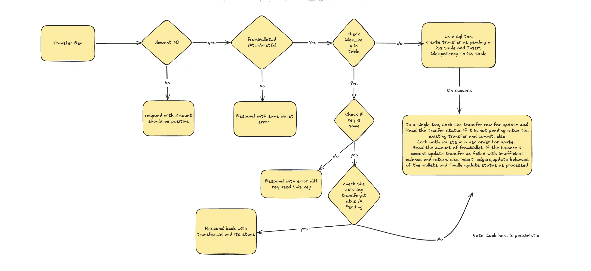

# Design Note — Wallet Transfer Service

## 1. Problem Statement
A service that moves money between two wallets, exactly once per client-supplied
idempotencyKey, with a double-entry ledger one for credit,debit and correct balances under
concurrent access.

## 2. API Contract
### `POST /transfers`

Req:
{
  "idempotencyKey": "abc123",
  "fromWalletId": "wallet_1",
  "toWalletId": "wallet_2",
  "amount": 100
}
Resp:

{
  "transferId": "b3f1...",
  "status": "PROCESSED",
  "fromWalletId": "wallet_1",
  "toWalletId": "wallet_2",
  "amount": 100,
  "failureReason": null,
  "createdAt": "2026-07-04T10:00:00Z"
}

Constraints in Req:

All fields are required. Amount >0 and in minor units (cents). fromWalletId and toWalletId should not be the same

Response status: 

400 - for violations in request constraints
404 - if the fromWalletId or toWalletId does not exist
409 - If idempotencyKey is used for other req body
201 - for success case or business failures with failure reason and apt ststus

Note: 201 is returned for business failures (e.g. insufficient balance) too, not just
PROCESSED. The transfer resource itself was durably created either way; the outcome lives
in the `status`/`failureReason` fields, not the HTTP status code.

## 3. Transfer State Machine

Transfer will be created as pending. 
During processing:
PENDING → PROCESSED
PENDING → FAILED

PROCESSED,FAILED are terminal

# 4. Out of Scope

Auth is out of scope
Wallet creation
Currency and cross currency
In buit retries and assumption is retried via Api call with same idempotencyKey.

## 5. Schema 

CREATE TABLE wallets (
    id          TEXT PRIMARY KEY,
    balance     BIGINT NOT NULL CHECK (balance >= 0),
    created_at  TIMESTAMPTZ NOT NULL DEFAULT now(),
    updated_at  TIMESTAMPTZ NOT NULL DEFAULT now()
);

CREATE TABLE transfers (
    id              UUID PRIMARY KEY,
    from_wallet_id  TEXT NOT NULL REFERENCES wallets(id),
    to_wallet_id    TEXT NOT NULL REFERENCES wallets(id),
    amount          BIGINT NOT NULL CHECK (amount > 0),
    status          TEXT NOT NULL CHECK (status IN ('PENDING','PROCESSED','FAILED')),
    failure_reason  TEXT,
    created_at      TIMESTAMPTZ NOT NULL DEFAULT now(),
    updated_at      TIMESTAMPTZ NOT NULL DEFAULT now(),
    CHECK (from_wallet_id <> to_wallet_id)
);
-- CREATE INDEX idx_transfers_from_wallet_failed
--     ON transfers (from_wallet_id, created_at)
--     WHERE status = 'FAILED';
-- this can be implemented if the UI requires failed transfer history

CREATE TABLE ledger_entries (
    id           UUID PRIMARY KEY,
    transfer_id  UUID NOT NULL REFERENCES transfers(id),
    wallet_id    TEXT NOT NULL REFERENCES wallets(id),
    type         TEXT NOT NULL CHECK (type IN ('DEBIT','CREDIT')),
    amount       BIGINT NOT NULL CHECK (amount > 0),            
    created_at   TIMESTAMPTZ NOT NULL DEFAULT now(),
    UNIQUE (transfer_id, type)
);
CREATE INDEX idx_ledger_entries_wallet_time ON ledger_entries (wallet_id, created_at DESC);

CREATE TABLE idempotency_records (
    idempotency_key TEXT PRIMARY KEY,
    request_hash    TEXT NOT NULL,
    transfer_id     UUID NOT NULL UNIQUE REFERENCES transfers(id),
    created_at      TIMESTAMPTZ NOT NULL DEFAULT now()
);

## 6. Flow

Link: https://excalidraw.com/#json=toRDplBxI6Qn8Plsm6kUw,N37c6hjz18KoZ67M5uuKYA

Note: the diagram's "check idem_key in table" step is a plain read and is not
race-free by itself — two concurrent requests with the same idempotencyKey can both miss it
before either commits. The `idempotency_records.idempotency_key` PK is what actually
prevents the duplicate: the losing insert fails with a unique-violation. On that violation,
treat it the same as an idem_key hit — re-fetch the record, validate the request hash, and
if the existing transfer's status is still PENDING, proceed into the lock-and-process step
instead of returning an error.

## Scenarios to be tested
- Business logic failures unknown wallet, self-transfer, Amount<=0
- Two concurrent reqs with same idempotencyKey with same req body and different req body
- Two concurrent reqs with different idempotencyKey for a fromWallet one is success and other leading to Insufficient Balance
- Circular dependency case where wallet_a ->wallet_b, wallet_b ->wallet_c , wallet_c -> wallet_a at the same time

